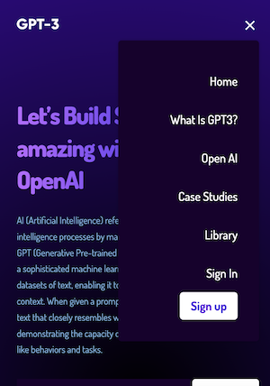
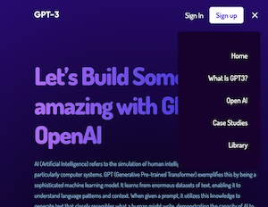
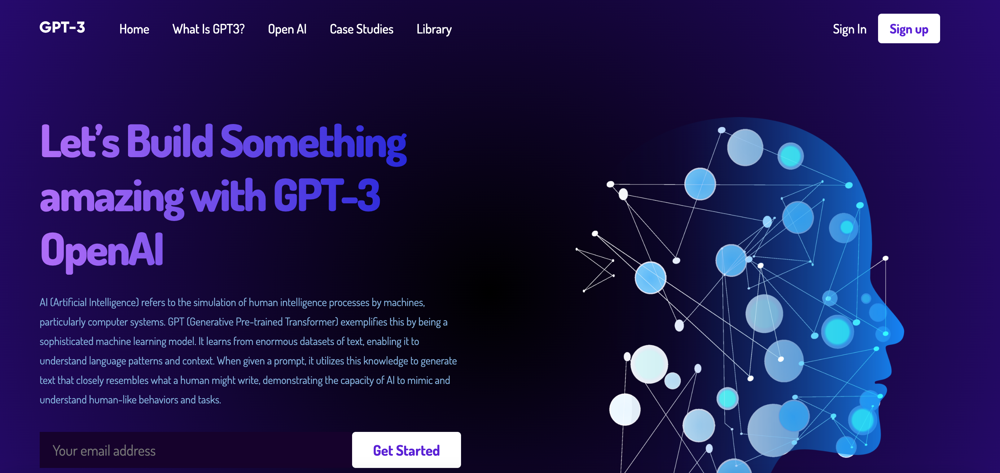

## About this project 
This project aims to promote the Generative Pre-trained Transformer 3 (GPT3), a large language model released by OpenAI, and encourage users to use this software to generate answers to their questions.

## Features 
Built using ReactJS, it features 5 main pages and 1 footer: 

**Main Pages** 
1. Home
2. What is GPT3?
3. Open AI
4. Case Studies
5. Library

**Footer** 
6. Links for users to learn more about GPT3.

## Built With 
This project uses ReactJS and is a frontend development project.

## Deployment 
Made mobile-responsive, users can choose to view on different screen sizes:
[Live link](https://introducing-chatgpt3.netlify.app/)

**Mobile (L size)** 
 
 

**Tablet** 
 
 

**Laptop** 
 
 

## Acknowledgements
- Adapted from tutorial guide by JSMastery.
- Includes pictures from Freepik.